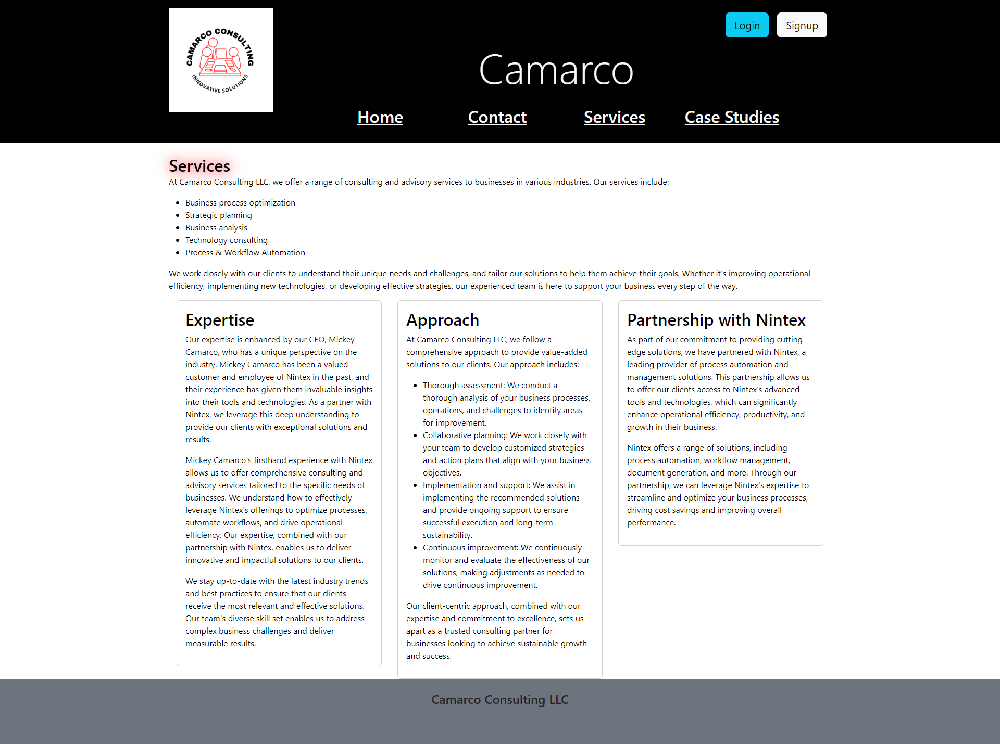

# Camarco Consulting LLC

## Description

The website being designed for Camarco Consulting LLC is a MERN stack single-page application that serves as an interactive platform for clients to access consulting services and solutions. The website aims to showcase Camarco Consulting's expertise, industry knowledge, and commitment to helping businesses achieve sustainable growth. It provides a user-friendly interface where clients can explore services, learn about the company's capabilities, and engage with the consulting team.

## Table of Contents

1. [Description](#description)
2. [Installation](#installation)
3. [Usage](#usage)
4. [License](#license)
5. [Contributing](#contributing)
6. [Tests](#tests)
7. [Questions](#questions)

## Installation Instructions

Upon opening the application you will be taken to the homepage, where you have the opportunity to sign in or sign up. You will also have the ability to see what Camaraco consulting has to offer your company. There is a  casestudies tab and a services tab as well as a contact form.

## Usage Information

The deployed link is: https://sleepy-cliffs-60033.herokuapp.com/

## License

This project is not licensed.

## Contribution Guidelines

Mickey - mcamarco  Adam - CrowTrooper202  Brooke White 

## Test Instructions

To run the tests for this application, use the following command:

`npm start`

The application will be accessible at http://localhost:3000.

## License

This project is not licensed.

## Contribution Guidelines

Contributions to this project are currently not open.

## Test Instructions

To run the tests for this application, use the following command:

`npm test`

## Questions

If you have any questions, please reach out to us at mickey@camarcoconsulting.com
